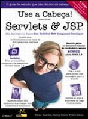
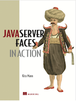
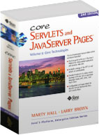
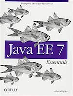

# Programação para a Web 1 (PWEB1)

## CST em Análise e Desenvolvimento de Sistemas, [IFPB - Campus Cajazeiras](http://ifpb.edu.br/cajazeiras)

### Professor

* Diego Pessoa ([diego.pessoa@ifpb.edu.br](mailto:diego.pessoa@ifpb.edu.br))

## Plano de ensino
* [Plano de Ensino](docs/plano-de-ensino.pdf) contendo ementa, objetivos, conteúdo e bibliografia.

### Horários / Local

* Horários:
  - **Terças (13:00-15:15)** - Lab.Inf.4 / Sala 03
  - **Quintas (15:30-17:45)** - Lab.Inf.1 / Sala 03

## Comunicação

Toda a comunicação será realizada usando o  no canal `#ads-pweb1`.

## Conteúdo e Cronograma de aulas

| Semana | Aulas | Tópicos                               | Homeworks       |
|:-:|:--------:|--------------------------------------|:-----------------:|
| 01 | 30-Out-01/Nov  | - [Apresentação da Disciplina](slides/00-Apresentacao.pdf);  - [1.1-Introdução ao desenvolvimento de aplicações Web](slides/01-1-Introducao-apps-web.pdf); - [1.2-Padrão MVC](slides/01-2-Padrao-MVC.pdf) | [HW1](hw/hw1.md) |
| 02 | 06-Nov/08-Nov  | - [2.1 JDBC](slides/02-1-JDBC.pdf)    | |
| 03 | 13-Nov/15-Nov  | - [2.2 Padrão DAO](slides/02-2-Padrao-DAO.pdf) | |
| 04 | 20-Nov/22-Nov  | - [3.1 Introdução a Servlets](slides/03-1-Introdução-a-Servlets.pdf)  - [3.2 Servlets - Gerenciamento de Aplicações](slides/03-2-Servlets-gerenciamento-aplicacoes.pdf) |  |
| 05 | 27-Nov/29-Nov  | - Integração com a visão: contexto e dispatchers; Sessão, cookies e escopos   - JSP e Expression Language |  |
| 06 | 04-Dez/06-Dez  | JSTL, tags customizadas e filtros |  |
| 07 | 11-Dez/13-Dez  | Workshop: oficina prática e desafios | |
| 08 | 18-Dez/20-Dez  | Prova | |
| 09 | 22-Jan/24-Jan  | Apresentação do Projeto I; Fundamentos de JSF e ciclo de vida | |
| 10 | 29-Jan/31-Jan  | Componentes JSF e facelets (layout, organização, componentes básicos) | |
| 11 | 05-Fev/07-Fev  | JSF: Componentes de input e tabelas | |
| 12 | 12-Fev/14-Fev  | Internacionalização, validadores e conversores | |
| 13 | 19-Fev/21-Fev  | Desenvolvendo um projeto prático - integrando funcionalidades da aplicação | |
| 14 | 26-Fev/28-Fev  | Construindo uma aplicação: design issues - problemas conhecidos |  |
| 15 | 12-Mar/14-Mar  | Construindo uma aplicação: bibliotecas gráficas, segurança e internacionalização |  |
| 16 | 19-Mar/21-Mar  | Desenvolvendo custom components e Prática com o desenvolvimento de aplicações |  |
| 17 | 26-Mar/28-Mar  | Prova |  |
| 18 | 02-Abr/04-Abr  | Entrega e Apresentação dos Projetos |  |
| 19 | 09-Abr  | Finais |  |

## Avaliações

A nota final será computado através da média das avaliações:

* Avaliação I (Prova Escrita 1)
* Avaliação II (Projeto 1)
* Avaliação III (Prova Escrita 2)
* Avaliação IV (Projeto 2)

## Bibliografia

### Bibliografia Básica

### Bibliografia Complementar

